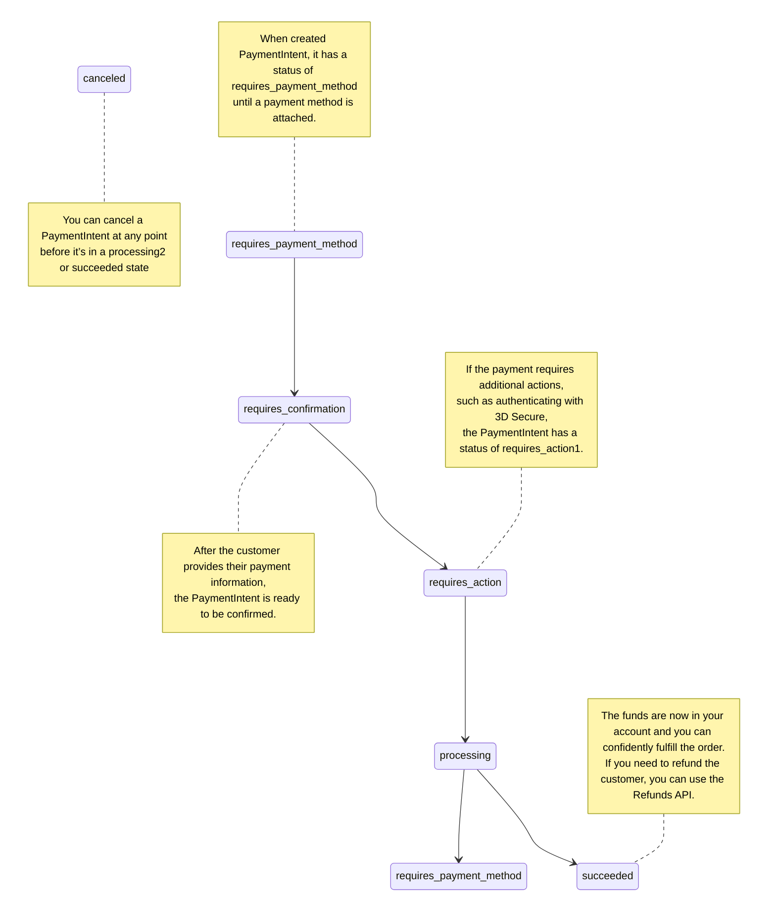

```mermaid {theme: 'neutral', scale: 0.6}
  stateDiagram-v2
      State1: requires_payment_method
      note left of State1
          When created PaymentIntent, it has a status of requires_payment_method
          until a payment method is attached.
      end note
      State2: requires_confirmation
      State1 --> State2
      note right of State2
          After the customer provides their payment information,
          the PaymentIntent is ready to be confirmed.
      end note
      State3: requires_action
      State2 --> State3
      note left of State3
          If the payment requires additional actions,
          such as authenticating with 3D Secure,
          the PaymentIntent has a status of requires_action1.
      end note
      State4: processing
      State3 --> State4
      State5: succeeded
      State6: requires_payment_method
      State4 --> State5
      note left of State5
          The funds are now in your account and you can confidently fulfill the order.
          If you need to refund the customer, you can use the Refunds API.
      end note
      State4 --> State6
      State7: canceled
      note right of State7
          You can cancel a PaymentIntent at any point
          before it’s in a processing2 or succeeded state
      end note
```
